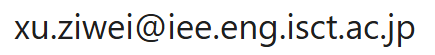

# Ziwei XU (許 子微)

Assistant Professor  
Dept. of Industrial Engineering & Economics, School of Engineering  
**Institute of Science Tokyo (東京科学大学)**

2-12-1 Ookayama, Meguro-ku,   
Tokyo 152-8552, Japan

Email:     
[Curriculum Vitae (last updated Jan 2025).](/assets/files/CV_Xu_mentor.pdf)

## Bio
I obtained my Ph.D. degree (2017–2021) in Computer Science from Nantes Université, France, under the supervision of Professor Fabrice Guillet and Professor Mounira Harzallah. Following that, I worked as a postdoctoral researcher (2022-2025) at the National Institute of Advanced Industrial Science and Technology (産業技術総合研究所), Japan.

My research interests include Artificial Intelligence, Machine Learning, Natural Language Processing, Knowledge Representation and Reasoning, Explainable AI, Graph Theory, and Causal Inference.

If you're interested in working together, you can find more details about the topics we might explore in [professor Ichise's lab](https://www.ai.iee.e.titech.ac.jp/).

## News
April 24th, 2025: I participated in and co-hosted an academic seminar in Karuizawa with [professor Hideaki TAKEDA](https://www.nii.ac.jp/faculty/informatics/takeda_hideaki/), [professor Ryutaro ICHISE](https://researchmap.jp/ichise?lang=en), [professor Mounira HARZALLAH](https://pagespersowp.ls2n.fr/mouniraharzallah/) and their lab members.  
April 1st, 2025: I started my new position as a faculty member at Institute of Science Tokyo.

* * *
For my academic connection in social network, please click the underneath **logos**:

